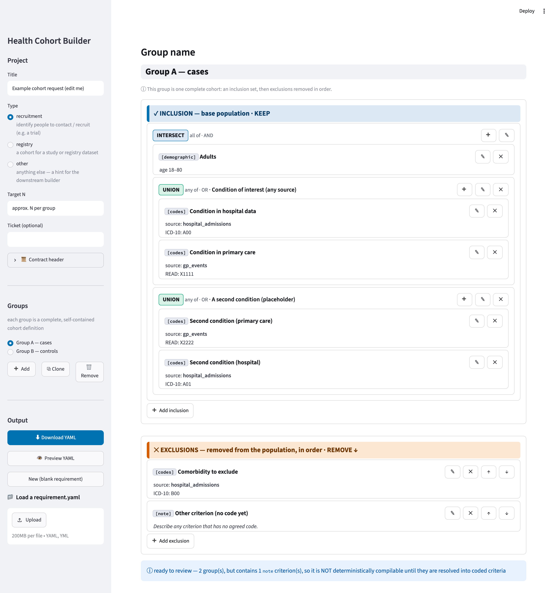

# Health Cohort Builder: portable cohort contracts

A cohort **contract** system. A researcher or analyst authors a cohort
definition in a structured Streamlit form and exports it as a
`requirement.yaml` contract. A **deterministic compiler** then combines the
contract with a per-site **binding manifest** to produce an executable script
for each execution site (SQL, or an RDMP-style command script). One contract,
many sites: two sites executing the same contract select the same patients by
construction. See `plan.md` for the design and `docs/SPEC.md` for the schema
spec.



## Design in one picture

```
requirement.yaml  ─┐   (the CONTRACT: logical sources only, persistent ids,
                   │    sealed with a body hash; authored/reviewed in the app)
sources.yaml       ├─► validator ─► compiler ─► per-site executable script
                   │   (registry: NORMATIVE     (SQL / RDMP Commands)
binding.<site>.yaml┘    matching semantics)
```

The requirement mirrors how a cohort is built:

```
INCLUSION container   (the base population, built first)
    items combine with AND (INTERSECT, "all of") or OR (UNION, "any of"); may nest
EXCLUSIONS            (an ordered list, removed in turn)
```

Each group is a complete, standalone cohort. There are five kinds of leaf
condition:

* `demographic`: age range and sex.
* `codes`: verbatim clinical codes on a logical source.
* `measure`: value thresholds, e.g. a lab result ≥ x.
* `sample`: a biobank sample positioned in time relative to an index event
  (offered in the form when `COHORT_ENABLE_SAMPLES` is set).
* `note`: a real criterion that has no agreed code yet. It is reviewable but
  never compilable, so it can never silently weaken a cohort.

`codes` and `measure` criteria take optional **timing**: an absolute date
window, an anchor relative to a per-patient index event ("first coded
diagnosis", before/after, within n months), or both.

## Layout

* `app.py`: the Streamlit form.
* `requirement_schema.py`: single source of truth (schema, strict gate, hashing, JSON Schema).
* `requirement.schema.json`: generated JSON Schema, kept in sync by a test.
* `sources.yaml` + `registry.py`: the logical source registry (normative matching semantics).
* `compiler/`: site bindings, feasibility checks, IR, SQL and RDMP emitters, CLI.
* `examples/`: worked example, three fixture contracts, two site bindings.
* `docs/SPEC.md`: requirements spec. `plan.md`: design plan (externally reviewed).
* `DEPLOYMENT.md`: run-behind-a-proxy checklist. `docs/security-review.md`: security review.
* `scripts/shoot_ui.py`: autonomous screenshot harness (headless render to PNG).
* `tests/`: schema, registry, compiler and Playwright interaction tests (100 in total).
* `ui_shots/`: generated screenshots (gitignored).

## Run

```bash
pip install -r requirements.txt
python -m playwright install chromium     # for screenshots and tests only

streamlit run app.py                       # the app
python -m pytest tests/                     # all tests

# compile a contract for a site (deterministic; no LLM anywhere):
python -m compiler examples/requirement.case-control.yaml \
                   examples/binding.site-a.yaml --target sql
python -m compiler examples/requirement.case-control.yaml \
                   examples/binding.site-b.yaml --check      # feasibility only
```

## Use

Build groups in the form: add conditions, add nested INTERSECT or UNION
subgroups, and add ordered exclusions. Use **Preview YAML** to review,
**Download YAML** to export, or **Load a requirement.yaml** to bring one back
in to edit. Use **Clone group** to start a similar cohort from a copy.

Every group, container and condition in the export carries a persistent `id`,
so criteria stay addressable across versions (for diffs, review comments and
feasibility errors). Loading is two-mode. A file that fails the **strict
contract gate** (unknown fields or kinds, wrong `schema_version`, missing ids)
still opens as a **draft**, and every coercion applied on the way in is
reported. Nothing is ever changed silently.

The sidebar **Contract header** records the parties and can **seal** the
contract: sealing marks it `agreed`, bumps the version, and stores a canonical
body hash, so any later edit is detected (and rejected by the gate) until the
contract is re-sealed. A contract that contains `note` criteria is flagged as
not deterministically compilable and the compiler refuses it; a `--draft`
compile emits an explicitly non-executable preview instead. Compilation is
fail-closed end to end (gate, then registry conformance, then site
feasibility, then emit), and any criterion the pipeline cannot prove it
supports is an error, never a silent drop.
